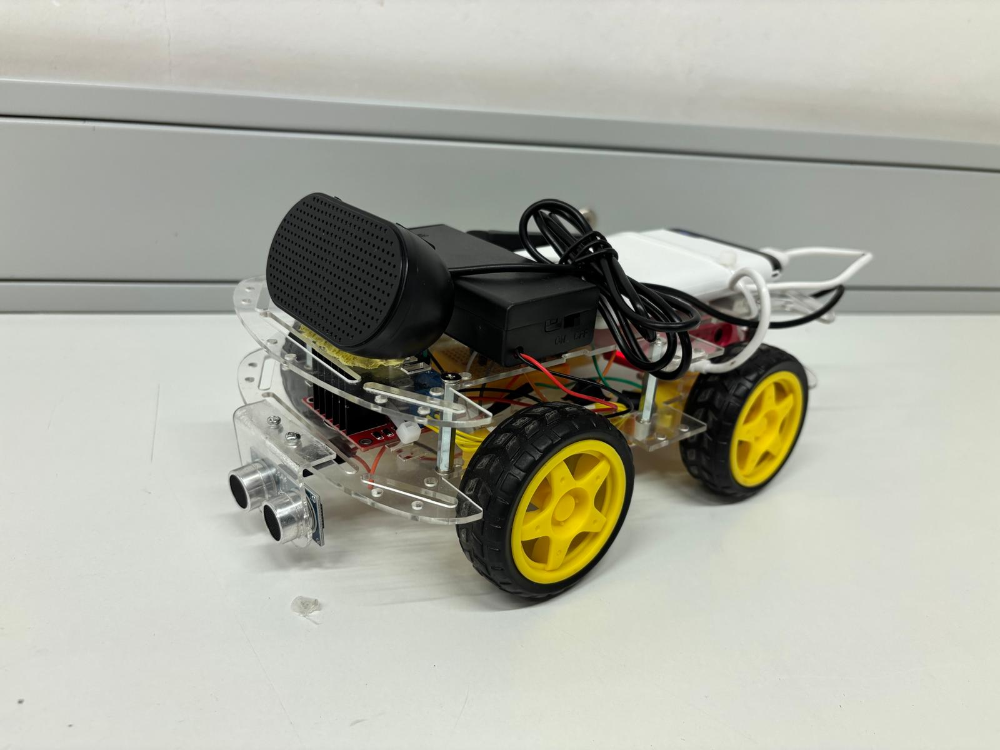
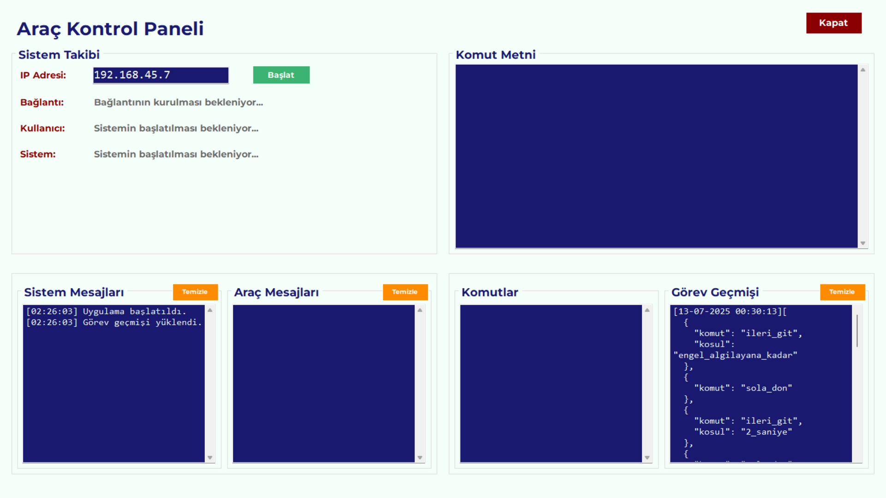

# TOBB ETÜ ELE495 - Capstone Project

## Natural Language Controlled Autonomous Mini Car

## Table of Contents

- [Introduction](#introduction)
- [Features](#features)
- [Installation](#installation)
- [Usage](#usage)
- [Screenshots](#screenshots)
- [Acknowledgements](#acknowledgements)

---

## Introduction

This project aims to design an autonomous mini vehicle that can recognize Turkish voice commands given in natural language and move accordingly. The system leverages speech-to-text and natural language processing technologies, providing real-time feedback to the user via speech and a graphical user interface. The core objective is to enhance human-machine interaction by enabling control through natural speech, making robotics more accessible and intuitive.

---

## Features

### Key Features & Functionalities

- **Voice-Controlled Movement**: The car understands Turkish natural language commands and executes movements such as moving forward, backward, turning or stopping.
- **User Authentication**: Only commands from pre-registered group members are accepted, ensuring secure operation.
- **Real-Time Feedback**: The car provides real-time audio feedback in Turkish using a text-to-speech (TTS) API.
- **User Interface**: A Windows desktop application (built with C# and WinForms) allows the user to monitor the vehicle’s state, command history, and system status live.
- **Sensor Integration**: Uses ultrasonic sensors for obstacle detection, enabling adaptive speed and safe navigation.
- **Flexible Command Input**: The system can process and understand free-form natural Turkish sentences, not just predefined patterns.
- **Robust Communication**: Communication between the car (Raspberry Pi) and the user interface is handled via the ZeroMQ protocol, supporting real-time, reliable messaging.

### Hardware Components

- **Raspberry Pi 4B (8GB RAM)**: Main controller and processor.
- **4 × 6V 250rpm DC Motors**: For driving and steering.
- **L298N Dual Motor Driver**: For controlling the motors.
- **2 × HC-SR04 Ultrasonic Sensors**: For obstacle detection (front and back).
- **2 × 3.7V 2900mAh Li-ion Batteries**: Power for motors.
- **128GB microSD Card**: Storage for OS and project files.
- **Speaker & USB Microphone**: For voice feedback and command input.
- **Powerbank (5V/3A, 10000mAh)**: Power supply for Raspberry Pi.
- **Custom-built Chassis**: Made from plexiglass sheets.

### Software Components

- **Operating System**: Raspberry Pi OS (Linux)
- **Main Programming Language**: Python (vehicle logic, API interaction, sensor control)
- **User Interface**: C# with WinForms (.NET)
- **APIs Used**:  
  - **Google Cloud Speech-to-Text**: Converts spoken Turkish to text.  
  - **Google Gemini (LLM)**: Processes text commands and outputs JSON-formatted actionable commands.  
  - **Google Cloud Text-to-Speech**: For spoken feedback.
- **Libraries**:  
  - **ZeroMQ** (network communication)  
  - **Watchdog** (file change tracking)  
  - **Resemblyzer** (voice authentication)
- **Service Management**: systemd `.service` and shell (`.sh`) scripts for running key processes at boot and maintaining system reliability.

---

## Installation

1. **Clone the Project Repository**
    ```bash
    git clone https://github.com/your-username/your-project-name.git
    cd your-project-name
    ```

2. **Prepare the Raspberry Pi**
   - Install the Raspberry Pi OS.
   - Enable SSH for remote access.
   - Install required Python libraries:
     ```bash
     pip install pyzmq watchdog resemblyzer google-cloud-speech google-cloud-texttospeech
     ```

3. **Hardware Setup**
   - Assemble the chassis.
   - Connect motors to the L298N driver, and wire driver outputs to Raspberry Pi GPIOs.
   - Connect ultrasonic sensors, microphone, and speaker as described in the hardware section above.

4. **Configure API Keys**
   - Obtain credentials for Google Cloud APIs and set up environment variables as required.

5. **Set Up systemd Services**
   - Place `.service` files and shell scripts in the appropriate system directories for background operation.
   - Run required codes on Raspberry Pi:
     ```bash
     python3 zmq_server.py &
     python3 pub_server.py &
     python3 file_monitor.py "$_JSON_FILE_PATH" "$TXT_FILE_PATH"
     ```

6. **Prepare the PC UI**
   - Install the Windows application from the provided Visual Studio solution.
   - Ensure .NET runtime is installed.

---

## Usage

- Power on the car and ensure it is connected to the same Wi-Fi network as your PC.
- Start the desktop application.
- Enter the IP address of the Raspberry Pi in the UI and connect.
- Once connected, the car is ready to receive and execute Turkish natural language voice commands.
- The UI will display real-time status, recognized voice commands, the JSON command list, and vehicle state (moving, stopped, turning, etc.).
- The car gives audio feedback on actions, errors, and user verification.
- Only authenticated group members can control the car via their voice.

---

## Screenshots




---

## Acknowledgements

- **Mentor:** Murat Sever
- **Contributors:**  
  - Feride Reyyan Kaya  
  - Doğa Evgür  
  - Bahar Kuzucu  
  - Meryem Ayşe Terzioğlu
- **Project Resources:**  
  - [Google Cloud Speech-to-Text](https://cloud.google.com/speech-to-text)
  - [Google Cloud Text-to-Speech](https://cloud.google.com/text-to-speech)
  - [Google Gemini](https://ai.google.dev/gemini-api/)
  - [ZeroMQ](https://zeromq.org/)
  - [Resemblyzer](https://github.com/resemble-ai/Resemblyzer)
  - [Raspberry Pi Foundation](https://www.raspberrypi.com/)